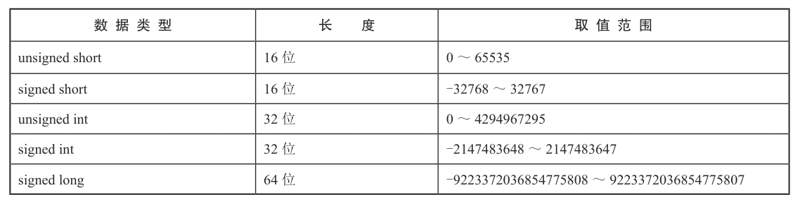
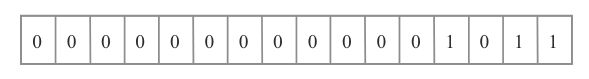
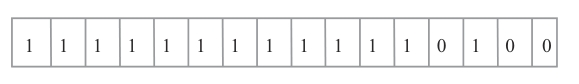
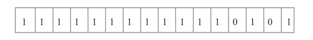
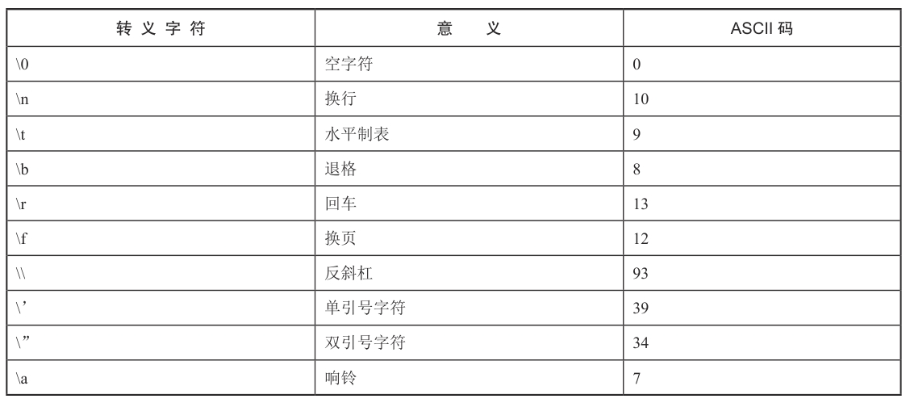
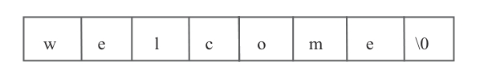
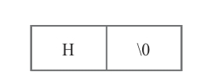
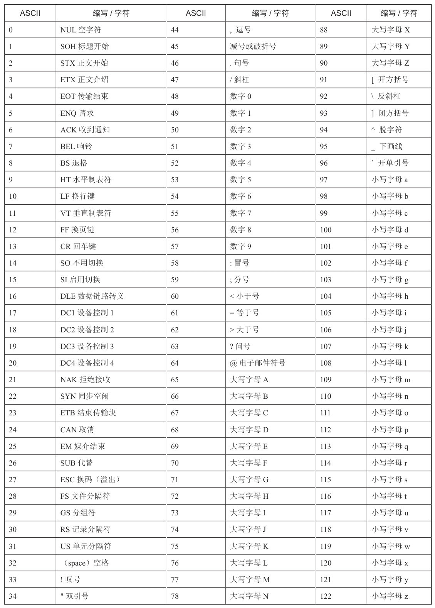
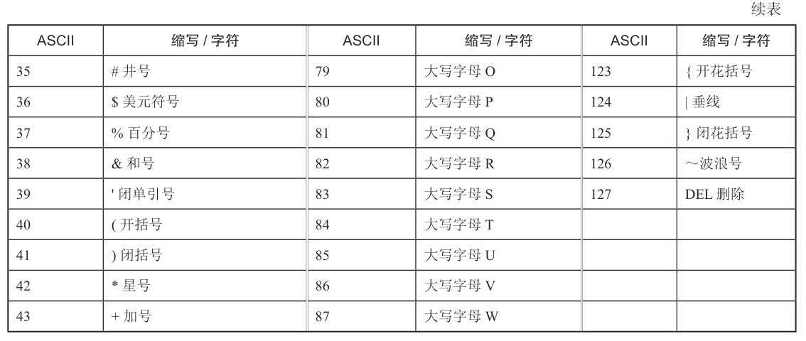

### 第一个C++程序

```c++
#include <iostream>

int main()
{
	std::cout << "hello,world" << std::endl;
	return 0;
}
```

代码第一行使用字符 #，这是一个**预处理标志**，表示该行代码要最先进行处理，所以要在编译代码之前运行 。

include 是一个预处理指令，其后紧跟一对尖括号 <>，尖括号内是一个标准库。

第二行代码使用命名空间 std。第三行到第六行代码是程序执行入口，main 函数是每个 C++ 程序都有的。

花括号代表 main 函数的函数体，可以在函数体内编写要执行的代码。


#### #include 指令

C++ 程序第一行带“#”号的语句被称为宏定义或预编译指令。include 是包含和引用的意思，其后面紧跟一对尖括号 <>，

第一行代码 #include <iostream> 就是说明要引用iostream 文件中的内容，

编译器在编译程序的时候会将 iostream 文件中的内容在 #include <iostream> 处展开。


#### iostream 标准库

文件 iostream（输入 / 输出）是一个标准库，直白地讲，就是输入（in）、输出（out）、stream（流），

它是取 in 和 out 的首字母与 stream 结合成的，包含众多函数。库中每个函数都有各自的作用。

如果不包含这个文件，就不能使用 cout 输出语句。读者需要记住，只有使用 #include<iostream> 这条语句，

才能在程序中使用有关功能。


#### 命名空间

在 C++ 中，命名空间的作用是减少和避免命名冲突。namespace 是指标识符的各种可见范围。

使用 C++ 标准库中的标识符时，一种简便的方法是使用下面的语句：

```c++
using namespace std;
```

这样命名空间 std 内定义的所有标识符都有效。所以在程序中我们使用 cout 输出字符串。

如果没有这条语句，就只能使用下面的语句显示一条信息：

```c++
std::cout << "hello world\n";
```


#### std:: 介绍

“std::”是一个命名空间的标识符，C++ 标准库中的函数或对象都是在命名空间 std 中定义的，

所以我们要使用的标准库中的函数或对象都要用 std 来限定。

对象 cout 是标准库提供的一个对象，而标准库在命名空间中被指定为 std，所以在使用 cout 的时候，前面要加上“std::”。

这样编译器就会明白调用的 cout 是命名空间 std 中的 cout。


#### main 函数

main 函数是程序执行的入口，程序从 main 函数的一条指令开始执行，直到 main 函数结束，整个程序也执行结束。

注意函数的格式：单词 main 后面有一个小括号 ()，小括号内放置参数。


#### 函数体

花括号 { } 中的内容是需要执行的内容，称为函数体。函数体是按代码的先后顺序执行的，写在前面的代码先执行，

写在后面的代码后执行。代码 cout << "Hello World\n"; 表示通过输出流输出单词 Hello World，

Hello World 两边的双引号代表其是字符串常量，cout 表示输出流，<< 表示将字符串传送到输出流。


#### 函数返回值

void 表示函数的返回值，用来判断函数执行情况，并返回函数执行结果。

void 代表不需要返回任何类型数据，如果要返回数据需要使用 return 语句。


#### 注释

代码注释是禁止语句的执行，编译器不会对注释语句进行编译。C++ 有两种注释方法：

```
"//"是单行注释，只能注释符号"//"后面的内容，到本行代码结束的位置结束；

"/**/"是多行注释，符号"/*"放在将要注释代码的前面，符号"*/"放在将要注释代码的末尾，
中间的内容就会被注释。另外，多行注释中不允许嵌套多行注释，例如 /*/**/*/，最后出
现的"*/"符号将无效
```


### 常量及符号

**常量就是在程序运行过程中不可以改变的数值**。例如，每个人的身份证号码就是一个常量，是不能被更改的。

常量可分为整型常量、浮点型常量、字符常量和字符串常量。


#### 整型常量

整型常量就是直接使用的整型常数，0、100、-200 等都是整型常量。

整型常量可以是长整型、短整型、符号整型和无符号整型。



不同的编译器的整型常量的取值范围是不一样的。

而且，可能在 16 位的计算机中整型常量为 16 位，而在 32 位的计算机中整型常量就为 32 位。

在编写整型常量时，可以在常量的后面加上符号 L 或 U 进行修饰。

L 表示该常量是长整型，Ｕ表示该常量为无符号整型，例如：

```c++
LongNum = 1000L; /*L 表示长整型 */
UnsignLongNum = 500U; /*U 表示无符号整型 */
```

[^表示长整型和无符号整型的后缀字母 L 和 U 可以是大写的，也可以是小写的。]: 


所有整型常量都可以通过三种形式表达，分别为八进制形式、十进制形式和十六进制形式。

下面分别进行介绍。

##### 1．八进制整数

使用的数据表达形式是八进制，需要在常数前面加上 0 进行修饰。八进制形式包含的数字是 0 ～ 7。例如：

```c++
OctalNumber1 = 0520; /* 在常数前面加上一个 0 代表八进制数 */
```


##### 2．十六进制整数

常量前面使用 0x 作为前缀（注意：0x 中的 0 是数字 0，而不是字母 O），表示该常量是用十六进制进行表示的。

十六进制形式包含数字 0 ～ 9 及字母 A ～ F。例如：

```c++
HexNumber1 = 0x460; /* 加上前缀 0x 表示常量为十六进制数 */
HexNumber2 = 0x3ba4;
```

[^字母 A ～ F 可以使用大写形式，也可以使用小写形式。]: 


##### 3．十进制整数

十进制形式是不需要在常量前面添加前缀的，包含的数字为 0 ～ 9。例如：

```c++
AlgorismNumber1 = 569;
AlgorismNumber2 = 385;
```


整型数据都以二进制形式存放在计算机的内存之中，数值是以补码的形式进行表示的。

**正数的补码与原码的形式相同，负数的补码是将该数绝对值的二进制形式按位取反再加 1。**

例如，十进制数 11 在内存中的表现形式如图所示。



十进制数 11 在内存中的表现形式

如果是 -11，那么它在内存中又是怎样表现的呢？因为是用补码进行表示，所以要先

将其绝对值求出，如图 所示；然后进行取反操作，如图所示，得到取反后的结果。



图进行取反操作取反之后进行加 1 操作，这样就得到最终的结果，如图所示。



**对于有符号整数，其在内存中存放的最左面的一位表示符号位。**

如果该位为 0，则说明该数为正数；如果该位为 1，则说明该数为负数。


#### 浮点型常量

浮点型常量也称为实型常量，是由整数部分和小数部分组成的，这两部分需要用小数点隔开。

#####  1．小数表示方法

科学记数法就是使用十进制的小数方法描述实型数据，例如：

```c++
SciNum1 = 123.45; /* 小数表示方法 */
SciNum2 = 0.5458
```

##### 2．指数方式

有时实型常量非常大或非常小，使用科学记数法是不利于观察的，可以使用指数法显示实型常量。

其中，使用字母 e 或 E 进行指数显示，如 514e2 表示的就是 51400，514e-2 表示的就是 5.14。

如上面的 SciNum1 和 SciNum2 代表的实型常量，使用指数法显示如下：

```c++
SciNum1 = 1.2345e2; /* 指数法显示 */
SciNum2 = 5.458e-1; /* 指数法显示 */
```

在编写实型常量时，可以在常量的后面加上符号 F 或 L 进行修饰。

**F 表示该常量是 Float（单精度类型），L 表示该常量为 Long Double（长双精度类型）。**

例如：

```c++
FloatNum=5.193e2F; /* 单精度类型 */
LongDoubleNum=3.344e-1L; /* 长双精度类型 */
```

如果不在常量的后面加上后缀，在默认状态下，实型常量为双精度类型。

在常量后面添加的后缀不区分大小写，大小写是通用的。


#### 字符常量

字符常量是用单引号括起来的一个字符，如‘a’和‘?’都是合法字符常量。

在对代码编译时，编译器会根据 ASCII 码表将字符常量转换成整型常量。

字符‘a’的 ASCII 码值是 97，字符‘A’的 ASCII 码值是 65，字符‘?’的 ASCII 码值是 63。

ASCII 码表中有很多通过键盘无法输入的字符，可以使用‘\ddd’或‘\xhh’引用这些字符。

可以使用‘\ddd’或‘\xhh’引用 ASCII 码表中所有的字符。

ddd 是 1 ～ 3 位八进制数代表的字符，\xhh 是 1 ～ 2位十六进制数代表的字符。

例如，‘\101’表示 ASCII 码“A”，‘\XOA’表示换行等。


转义字符是特殊的字符常量，以字符“\”代表开始转义，其后面的字符表示转义后的字符。转义字符如表所示。




#### 字符串常量

字符串常量是用一组双引号括起来的若干字符序列，如 "ABC"、"abc"、"1314" 和 " 您好 "等都是正确的字符串常量。

如果字符串中一个字符都没有，将其称作空字符串，字符串的长度为 0，如 ""。

在 C++ 中，存储字符串常量时，**系统会在字符串的末尾自动加一个“\0”作为结束标志**。

例如，字符串“welcome”在内存中的存储形式如图所示。



[^在程序中编写字符串常量时，不必手动在一个字符串的结尾处加上“\0”结束字符，]: 


前面介绍了有关字符常量和字符串常量的内容，那么它们之间有什么区别呢？具体体现在以下几方面。

（1）**定界符的使用不同**。字符常量使用的是单引号，字符串常量使用的是双引号。

（2）**长度不同**。上面提到字符常量只能有一个字符，也就是说，字符常量的长度是 1。

字符串常量的长度可以是 0，但是需要注意的是，即使字符串常量中的字符只有 1 个，长度却不是 1。

例如，字符串常量 H 的长度为 2。通过图 2.13 可以体会到字符串常量 H 的长度为 2 的原因。



（3）**存储方式不同**。在字符常量中，存储的是字符的 ASCII 码值，如‘A’为 65，‘a’为 97；

而在字符串常量中，不仅要存储有效的字符，还要存储结尾处的结束标志“\0”。


####  ASCII 码

在 C 语言中，使用的字符被一一映射到一个表中，这个表被称为 ASCII 码表






#### 其他常量

前面讲到的常量都是普通常量，常量还包括布尔常量、枚举常量、宏定义常量等。

● 布尔（bool）常量：只有两个，一个是 true，表示真；一个是 false，表示假。

● 枚举常量：枚举型数据中定义的成员也都是常量，这将在后文介绍。

● 宏定义常量：通过 #define 宏定义的一些值也是常量。例如：

#define PI 3.1415 

其中的 PI 就是常量。


### 变量

